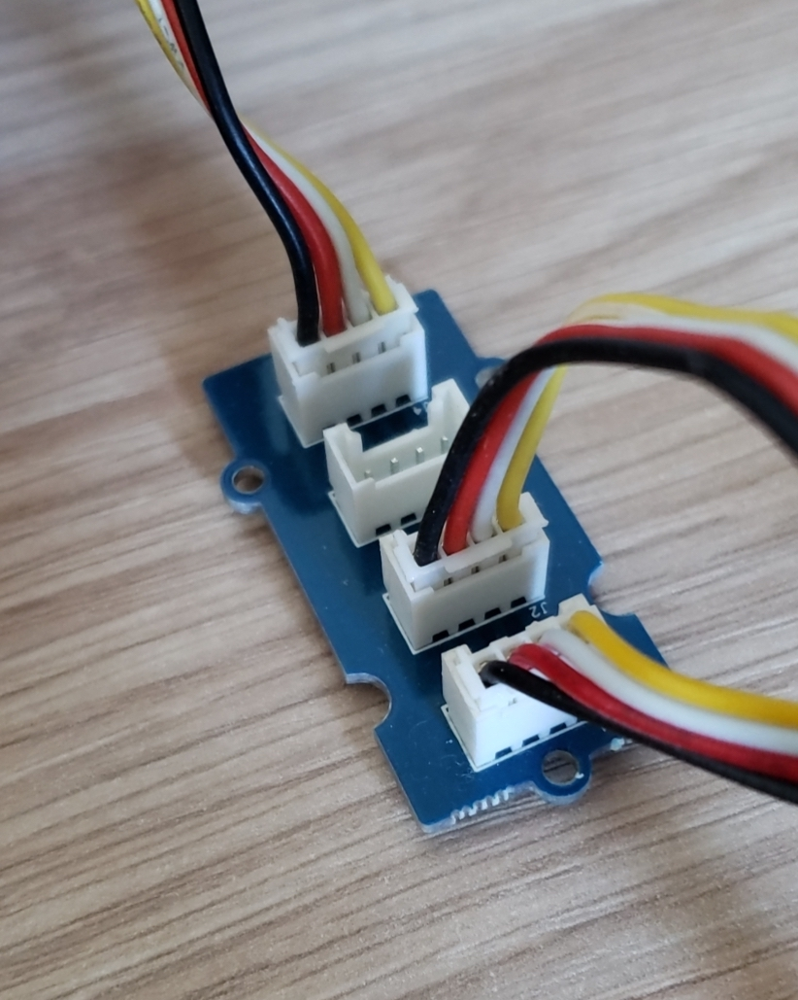
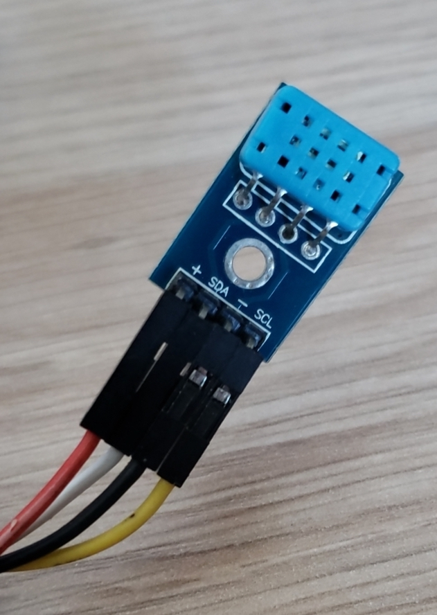
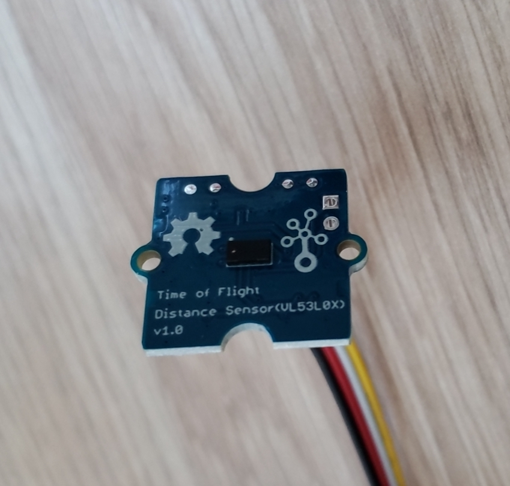
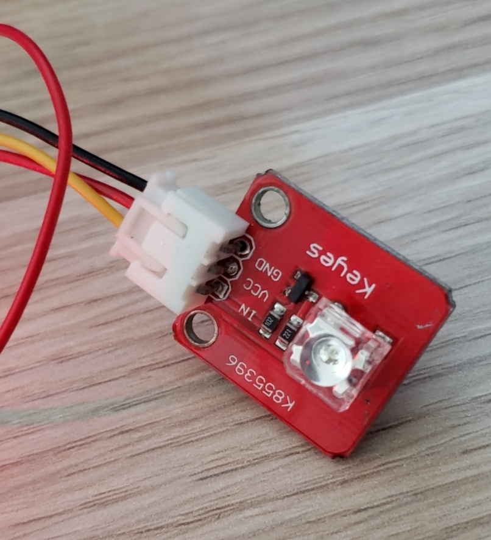

# BastWAN_Continuous_Ranging

A project demonstrating I2C capabilities of the BastWAN.

It requires 2 libraries, one of which is included in the code:

* `DHT12.c/h` I2C version of the DHT11.
* `Seeed_vl53l0x.h` The driver for the Grove - [Time of Flight Distance Sensor](https://wiki.seeedstudio.com/Grove-Time_of_Flight_Distance_Sensor-VL53L0X/).

An I2C hub is connected to the SDA/SCL pins, plus GND/Vcc. On this hub are the VL53L0X and DHT12. An LED is connected on A0 + GND/Vcc.

Using the `Continuous Ranging.ino` sketch I repurposed it to activate the DHT12 code when the detected range is below 45 cm. To avoid accidental triggers, it wait for 10 continuous hits, then turns on the LED, and displays the temperature and humidity. It then waits for the VL53L0X to report a measure distance above 45 cm.

One could add sending a LoRa packet at this point. I'll leave this to you as an exercice. :-)

